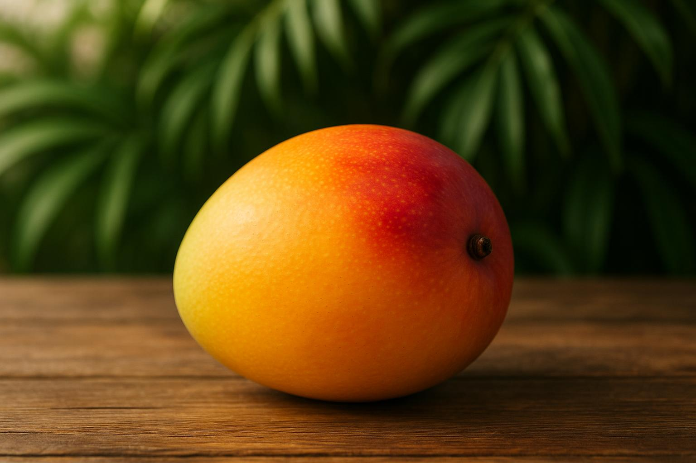

# 🍊 Frutas Brasileiras

Site estático sobre frutas tropicais brasileiras - Manga, Jaca e Goiaba.



## 📋 Sobre o Projeto

Este é um site educativo e informativo que celebra a riqueza das frutas tropicais brasileiras. O projeto apresenta três das frutas mais populares do Brasil: **Manga**, **Jaca** e **Goiaba**, com informações nutricionais detalhadas, benefícios para a saúde e imagens de alta qualidade.

## ✨ Características

- 🎨 **Design Tropical Vibrante** - Paleta de cores inspirada nas frutas brasileiras
- 📱 **Totalmente Responsivo** - Funciona perfeitamente em dispositivos móveis, tablets e desktops
- 🖼️ **Imagens de Alta Qualidade** - Fotografias profissionais geradas por IA
- 📊 **Informações Nutricionais** - Dados sobre vitaminas, minerais e calorias
- ⚡ **Performance Otimizada** - Construído com React e Vite para carregamento rápido
- 🎯 **Navegação Intuitiva** - Interface limpa e fácil de usar

## 🚀 Tecnologias Utilizadas

- **React 19** - Biblioteca JavaScript para interfaces de usuário
- **TypeScript** - Superset tipado do JavaScript
- **Vite** - Build tool moderna e rápida
- **Tailwind CSS 4** - Framework CSS utilitário
- **shadcn/ui** - Componentes de UI reutilizáveis
- **Wouter** - Roteamento leve para React
- **Lucide React** - Ícones modernos

## 📦 Instalação

### Pré-requisitos

- Node.js 18+ 
- pnpm (recomendado) ou npm

### Passos

1. Clone o repositório:
```bash
git clone https://github.com/jvbenicio2000/frutas-brasileiras.git
cd frutas-brasileiras
```

2. Instale as dependências:
```bash
pnpm install
# ou
npm install
```

3. Inicie o servidor de desenvolvimento:
```bash
pnpm dev
# ou
npm run dev
```

4. Abra o navegador em `http://localhost:3000`

## 🏗️ Build para Produção

```bash
pnpm build
# ou
npm run build
```

Os arquivos otimizados estarão na pasta `dist/`.

## 📁 Estrutura do Projeto

```
frutas-brasileiras/
├── client/
│   ├── public/          # Arquivos estáticos (imagens)
│   │   ├── manga.jpg
│   │   ├── jaca.jpg
│   │   └── goiaba.jpg
│   └── src/
│       ├── components/  # Componentes reutilizáveis
│       ├── pages/       # Páginas da aplicação
│       ├── App.tsx      # Componente principal
│       └── main.tsx     # Ponto de entrada
├── package.json
├── vite.config.ts
└── README.md
```

## 🍎 Frutas Apresentadas

### 🥭 Manga
- Rica em vitaminas A, C e E
- 60 kcal por 100g
- Excelente para a saúde da pele e sistema imunológico

### 🍈 Jaca
- Rica em potássio, magnésio e cálcio
- 95 kcal por 100g
- Maior fruta que cresce em árvores (até 40kg!)

### 🍐 Goiaba
- Contém mais vitamina C que a laranja (228mg)
- 68 kcal por 100g
- Poderoso antioxidante

## 🌐 Deploy

Este projeto está configurado para deploy fácil na Vercel:

[](https://vercel.com/new/clone?repository-url=https://github.com/jvbenicio2000/frutas-brasileiras)

Ou siga os passos:

1. Faça fork ou clone este repositório
2. Acesse [vercel.com](https://vercel.com)
3. Importe o repositório
4. Deploy automático!

## 📄 Licença

Este projeto é de código aberto e está disponível sob a licença MIT.

## 👨‍💻 Autor

Desenvolvido com ❤️ no Brasil

---

**Celebrando a riqueza das frutas tropicais brasileiras** 🇧🇷
